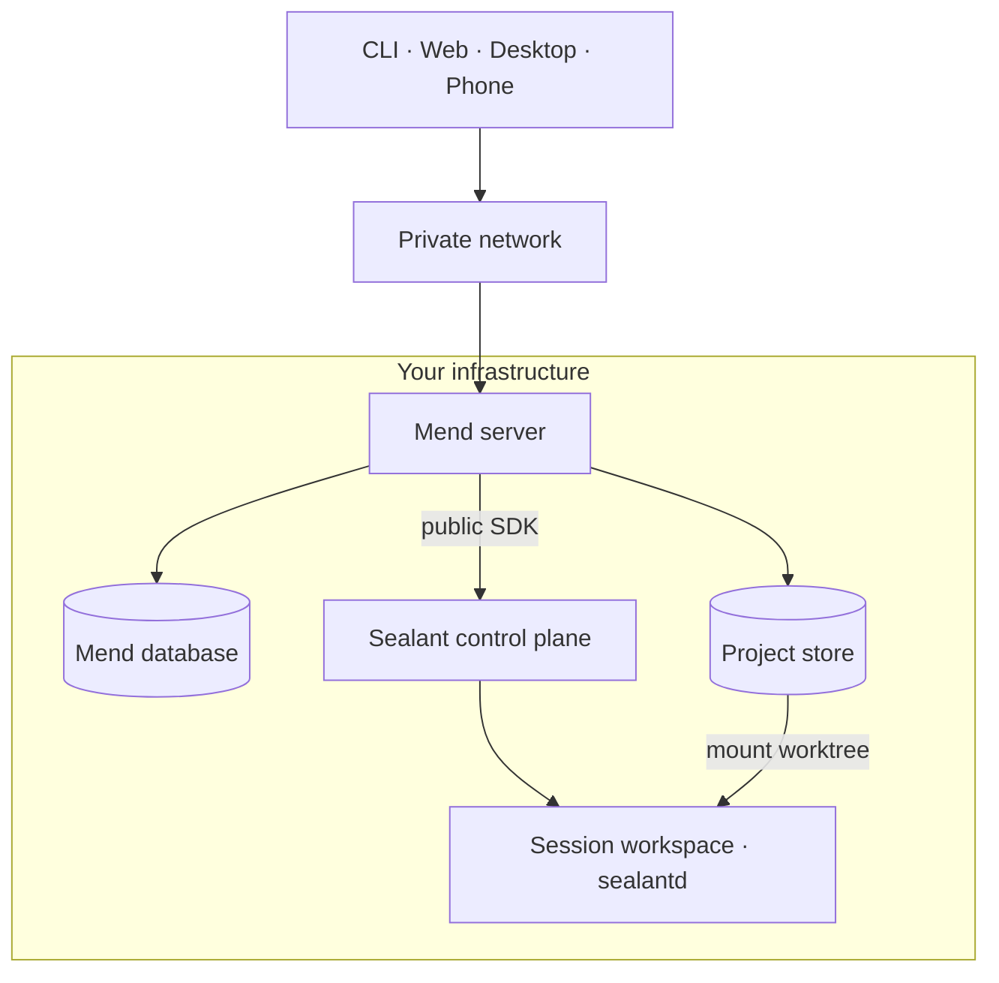
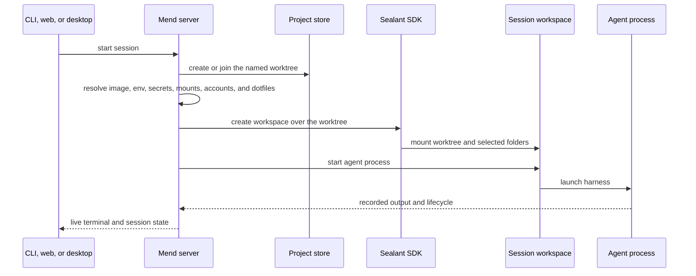
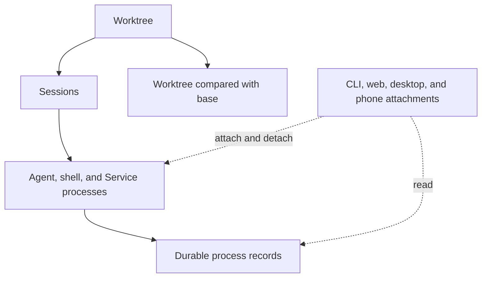

Mend puts the work on a machine you control and makes that machine reachable through familiar local
interfaces. The CLI still behaves like a terminal command. The web and desktop apps still behave
like local tools. The agent process, worktree, and development services keep running on the Mend
machine when a client disconnects.

## Deployment

A Mend installation has one product boundary. Clients connect to Mend. Underneath, Mend is built on
**Sealant**: a separate workspace platform that creates the isolated environments where agents run,
builds their images, supervises their processes, and records everything that happens in them. Mend
talks to Sealant only through its public SDK, and every install ships both — you never use Sealant
directly.

The supervision and recording happen inside the workspace itself. Every workspace container boots
`sealantd`, a static Sealant binary that runs as PID 1: it starts and watches the agent, shell, and
Service processes, writes their typed record events (process, io, file, network, runtime), and
answers the control channel the Sealant control plane drives — a local control socket on a single
host, an authenticated network channel on Kubernetes. When Mend attaches a terminal, replays a
record, or runs a check, that request ends at `sealantd` in the workspace.



The installer binds Postgres and the Sealant control plane to loopback. The current installer starts
the Mend HTTP server on all host interfaces. Use a private network such as Tailscale when another
device needs to reach it.

## Project store

Adopting a repository creates a Mend-owned copy in the central store:

```text
<store>/<project>/repo.git       bare repository
<store>/<project>/worktrees/...  one directory per worktree
```

Mend never runs an agent against an existing checkout that it does not own. Your previous checkout
remains a peer. Exchange commits through Git when you want work to move between them.

The bare repository is shared by the project's worktrees. A worktree is a durable named place — its
own checkout on its own branch — and sessions are conversations inside it. Two worktrees never share
a working directory, so unrelated work runs side by side; two sessions in the same worktree
deliberately do share one, which is how a second agent joins work already in progress.

## Starting a session

A launch joins repository state, project configuration, and your account settings at one boundary.



Changes to project setup apply to the next workspace launch. A running workspace keeps the image,
variables, secrets, mounts, and dotfiles it started with. Resuming a settled session creates a new
workspace when no retained workspace remains, so the latest setup applies then.

## What persists

A browser tab or terminal attachment is only a client. Closing it does not define the session's
lifetime.



The worktree is the durable place; a session is one conversation against it plus its record. A
worktree holds many sessions over its life — several can be live at once — and it survives every one
of them: deleting a session leaves the worktree, its change, and its checkpoints standing. Agent
processes can stop and resume over the life of a session. Supporting shells and Services use the
same workspace and can keep it alive after an agent settles.

## Where uncommitted files live

The session worktree is a normal directory on the Mend machine, under
`<store>/<project>/worktrees/`. The workspace mounts it, so every file the agent or a shell writes
lands directly in that directory on the host, never only in a container filesystem. That placement
decides what survives each lifecycle event:

- An agent that exits, a session that settles, or a workspace that stops or is replaced leaves the
  worktree exactly as the last process left it. Uncommitted files, staged or not, stay on disk. Mend
  never commits, stashes, or cleans them.
- Resuming a settled session mounts the same worktree into the next workspace. Everything is where
  it was, committed or not, and the reviewable change (the worktree against its base) includes it.
- Everything outside the worktree is ephemeral. Packages installed into the container, files in the
  workspace home directory, and `/tmp` disappear when the workspace is replaced. The exception is a
  read-write extra mount, which writes to its host folder directly.
- Removing a session is the only operation that deletes the worktree, and it takes uncommitted
  changes with it. Mend refuses to remove a session while its processes are live, but it does not
  check for uncommitted work — review, commit, or export before removing.

## Environment and identity

Mend resolves several inputs before creating a workspace:

- the project or global workspace image;
- configuration variables and secrets;
- selected reference repositories and extra host-folder mounts;
- the launching user's connected Claude, Codex, and GitHub accounts;
- the launching user's synced dotfiles when the project enables them;
- Service recipes from `mend.toml`;
- the session worktree and base reference.

Read [Configure session environments](/guides/project-environment/) for the full setup path.

## Context status

Repository instructions, mounted references, project configuration, and previous session records
already live beside the work. Named context items, context packs, immutable session snapshots, and
editable handoffs are part of the product direction but are not shipped yet.

Read [Context](/concepts/context/) for the current boundary.
