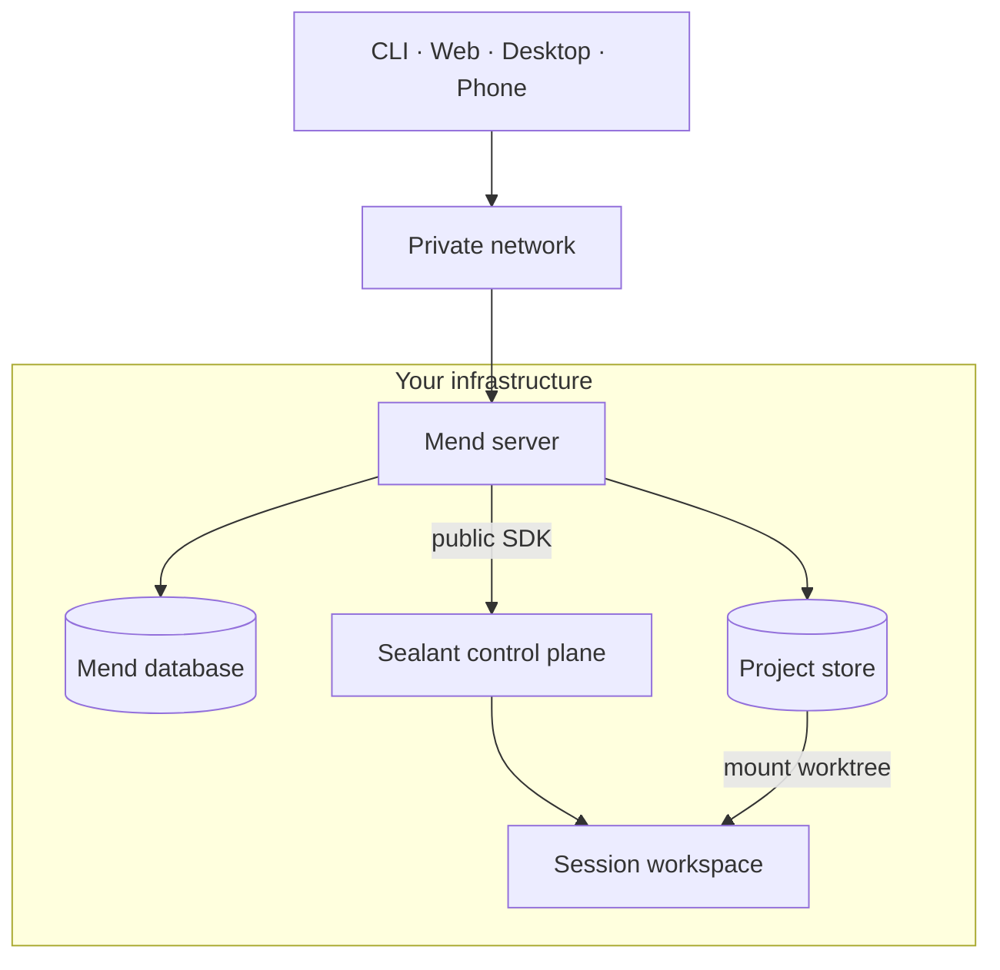
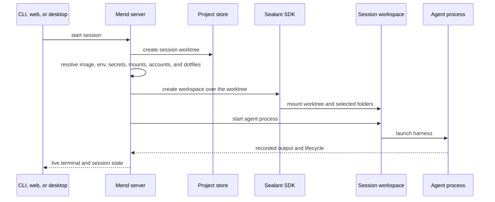
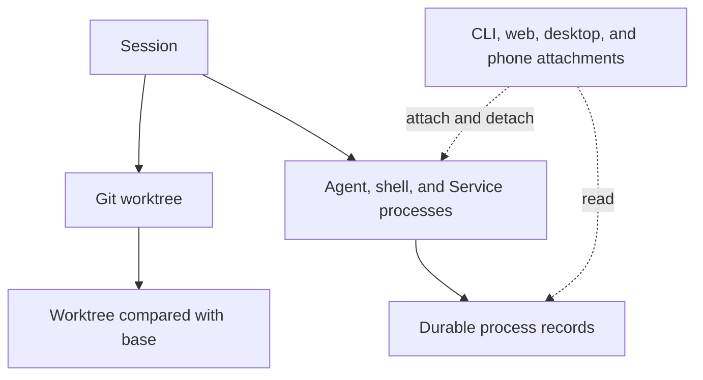

Mend puts the work on a machine you control and makes that machine reachable through familiar local
interfaces. The CLI still behaves like a terminal command. The web and desktop apps still behave
like local tools. The agent process, worktree, and development services keep running on the Mend
machine when a client disconnects.

## Deployment

A Mend installation has one product boundary. Clients connect to Mend. Mend uses the public Sealant
SDK to create and control workspaces.



The installer binds Postgres and the Sealant control plane to loopback. The current installer starts
the Mend HTTP server on all host interfaces. Use a private network such as Tailscale when another
device needs to reach it.

## Project store

Adopting a repository creates a Mend-owned copy in the central store:

```text
<store>/<project>/repo.git       bare repository
<store>/<project>/worktrees/...  one worktree per session
```

Mend never runs an agent against an existing checkout that it does not own. Your previous checkout
remains a peer. Exchange commits through Git when you want work to move between them.

The bare repository is shared by the project's session worktrees. Each session writes to its own
worktree, so two agents can work at the same time without sharing a working directory.

## Starting a session

A launch joins repository state, project configuration, and your account settings at one boundary.



Changes to project setup apply to the next workspace launch. A running workspace keeps the image,
variables, secrets, mounts, and dotfiles it started with. Resuming a settled session creates a new
workspace when no retained workspace remains, so the latest setup applies then.

## What persists

A browser tab or terminal attachment is only a client. Closing it does not define the session's
lifetime.



The session is the worktree plus its record. Agent processes can stop and resume over the life of a
session. Supporting shells and Services use the same workspace and can keep it alive after an agent
settles.

## Environment and identity

Mend resolves several inputs before creating a workspace:

- the project or global workspace image;
- configuration variables and secrets;
- selected reference repositories and extra host-folder mounts;
- the launching user's connected Claude, Codex, and GitHub accounts;
- the launching user's synced dotfiles when the project enables them;
- Service recipes from `mend.toml`;
- the session worktree and base reference.

Read [Configure session environments](/guides/project-environment/) for the full setup path.

## Context status

Repository instructions, mounted references, project configuration, and previous session records
already live beside the work. Named context items, context packs, immutable session snapshots, and
editable handoffs are part of the product direction but are not shipped yet.

Read [Context](/concepts/context/) for the current boundary.
