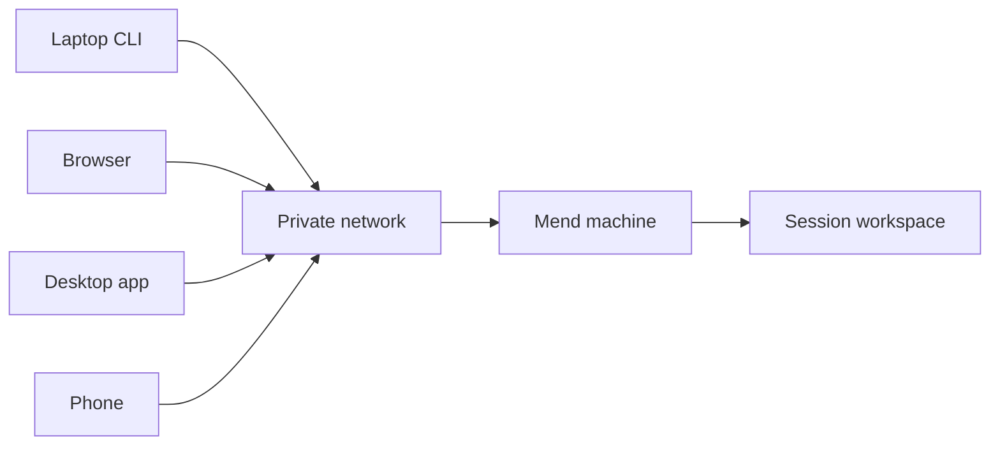

The work stays on the Mend machine. Other devices attach to it.

A terminal attachment, browser tab, desktop window, or phone is a client of the same session.
Closing one does not stop the agent, delete the worktree, or move the development service.



## Use a private network

The installer exposes the Mend server so another device on the host's LAN or tailnet can reach it.
Postgres and the Sealant control plane stay on loopback.

Prefer Tailscale or another private network. Mend does not require public ingress for remote use. Do
not publish the server directly to the internet.

Plain HTTP on a LAN does not protect credentials from that network. If you are not using a private
encrypted network, place a trusted TLS boundary in front of Mend and test terminal WebSockets before
relying on it.

## Pair another device

On a signed-in machine, run:

```sh
mend pair
```

The command prints a QR code, a short code, and the address the second device should open. A pairing
code is valid for one device, one claim, and ten minutes.

Override the advertised address when automatic detection chooses the wrong interface:

```sh
mend pair --url http://mend-host.example:3105
```

After a successful claim, the new device receives its own revocable token. Revoke devices from
**Settings**.

Current device tokens have normal authenticated API access. Read-only and control scopes are planned
but not enforced yet. Pair only devices and users you trust with the whole Mend instance.

## Reattach from another terminal

Install the Mend CLI on the second machine, point it at the server, and sign in:

```sh
mend login --url http://mend-host:3105
mend sessions
mend attach <session-id-prefix>
```

`mend attach` replays the terminal stream and then follows live output. Press `Ctrl+]` to detach
without stopping the process. Set `MEND_DETACH_KEY=none` when an outer terminal multiplexer owns the
detach key.

## Browser and desktop

The web and desktop apps list the same projects and sessions. Use them to follow output, open a
shell, inspect project setup, and review the current change.

A browser disconnect does not define session status. Reopening the session resumes from its durable
record.

## Phone

The responsive web app is the no-install phone path. The native client under `apps/mobile` is not
published yet.

Mobile is for steering, terminal access, session status, development-service links, and review. It
is not intended to replace a full editor.

## Development services

A declared Service runs in a session workspace and receives a stable host port while live. On the
machine running the Mend server, that port is local; from another device, run
`mend service connect <name>` to bind the same port on your own loopback over an authenticated
WebSocket — it works on every deployment shape and needs no extra network exposure.

Raw forwarded ports do not pass through Mend request authentication; when you expose one directly,
the private network is the access boundary. Declare HTTP or HTTPS before presenting a Service as a
browser link.
