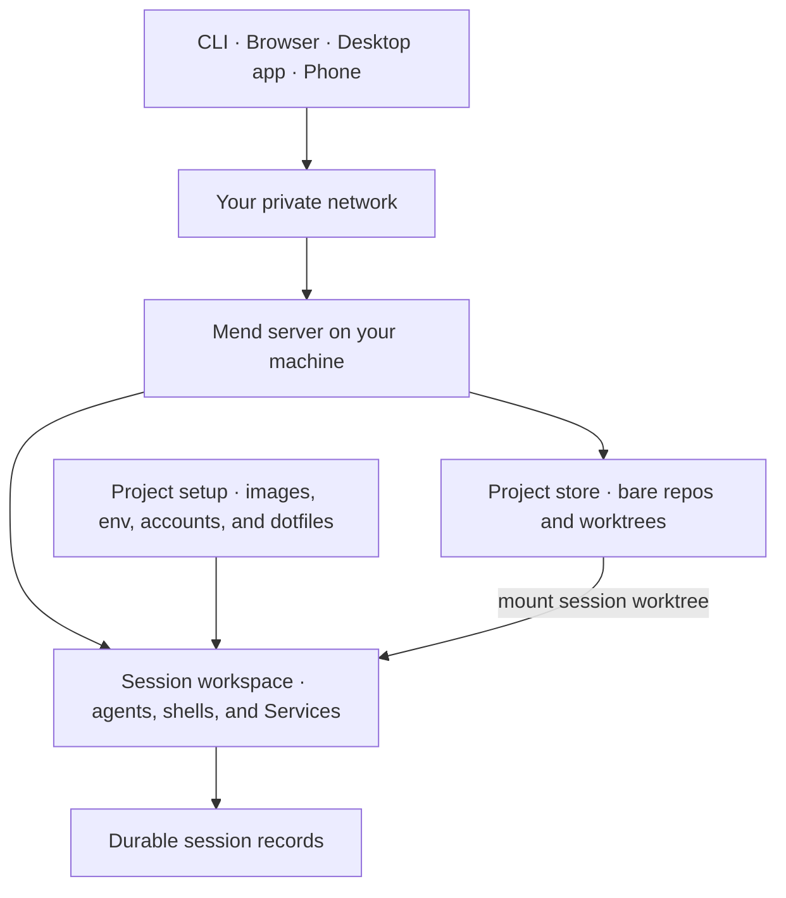
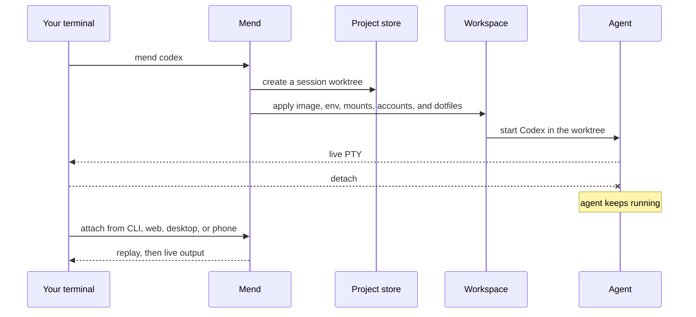

## Introduction

Mend is a self-hosted workbench for developers who run coding agents heavily, across projects and
devices. It co-locates the agents, their git worktrees, and the project context they run with on one
machine you control, and keeps working there feeling like local development from whichever device
you pick up: the terminal on your laptop, a browser, the desktop app, your phone.

Mend adopts repositories into one central store, gives every session its own git worktree, and runs
your existing agent inside a managed workspace over that worktree. Every workspace boots `sealantd`,
the Sealant supervisor that runs as PID 1 in the container: it starts the agent and any shells or
Services, records what they do, and serves the control channel Mend drives through the Sealant SDK.

Sessions live on the Mend machine, not in your terminal, so a terminal is just one client. Start
Codex or Claude Code from the CLI and close the laptop. The agent keeps running next to its
worktree, dependencies, and development services, and you can attach again from any client, with
scrollback replayed and then the live process.

Development servers get the same treatment. Wrap the command you already run, `pnpm dev` or anything
else, in `mend service run` and it becomes a supervised Service of the session. In the browser it
behaves like a local dev server, hot reload and all, while it actually runs next to the agent on the
Mend machine. Nothing is exposed by default: opening the port to your private network is an explicit
operator choice, and the public internet is never one of the options. When the server is remote, the
CLI brings the port to your laptop's loopback over an authenticated tunnel automatically, so
starting a Service and reaching it are one step.

Each launch also carries the agent's working inputs: repository instructions, mounted references,
project configuration, provider accounts, dotfiles, and previous session state. Named context packs
and immutable snapshots are planned; the inputs listed here work today.



## What Mend puts in one place

- Repositories adopted into a Mend-owned store, with a separate Git worktree for every session.
- Codex, Claude Code, OpenCode, and arbitrary interactive commands launched through one session
  model.
- Workspace images, packages, setup commands, environment variables, secrets, mounts, references,
  and development Services configured per project.
- Personal Claude, Codex, and GitHub accounts plus dotfiles that follow the user who starts a
  session.
- Agent, shell, and Service processes that keep running when a terminal or browser disconnects.
- CLI, web, desktop, and phone access to the same projects and sessions over a private network.
- The session's accumulated Git change and the record of what happened while the agent worked.

Named context packs, immutable context snapshots, and editable session handoffs are part of the
product direction but are not shipped yet. Repository instructions, mounted references, project
configuration, dotfiles, connected accounts, and previous session state are available now.

## Quick look

A session starts where your normal terminal workflow starts:

```sh
mend adopt
mend codex
```

Mend performs the remote setup around that familiar command:



The CLI attaches your terminal to a real supervised process. Shell input, resize events, detachment,
scrollback, and process exit still behave like terminal work.

## Workspaces that match the project

Mend resolves a project's launch inputs before it creates a workspace:

- choose Arch, Ubuntu, Fedora, or Nix, or provide a custom OCI base image;
- add packages and custom-image setup commands;
- select `bash`, `zsh`, or `fish` for managed images;
- load plaintext configuration and encrypted write-only secrets;
- connect your Claude, Codex, and GitHub accounts;
- sync dotfiles from the machine where they live;
- mount reference repositories and extra host folders;
- declare development Services in `mend.toml`.

Running workspaces keep the setup they started with. New launches and fresh resumes use the latest
project settings.

Read [Configure session environments](/guides/project-environment/) for the full setup model.

## Get started

### Install Mend

```sh
curl -fsSL https://mend.sealant.dev/install.sh | sh
```

The installer sets up Mend and Sealant — the workspace platform underneath Mend that runs and
records the isolated environments where agents execute — on your machine. Read
[Install Mend](/getting-started/install/) for prerequisites and the current network boundary.

### Connect an agent account

```sh
mend login
mend connect codex
mend accounts
```

Mend reads the credential created by the provider's CLI and sends it directly to your connected
account. It does not keep another copy. Read [Connect provider accounts](/guides/provider-accounts/)
for Claude, Codex, GitHub, replacement, and removal.

### Adopt a repository and start

```sh
cd ~/Developer/my-project
mend adopt
mend codex
```

Adoption creates the central bare repository. Starting the session creates its worktree and
workspace, then attaches your terminal to the agent. Read
[Adopt a project](/getting-started/adopt-project/) and
[Start a session](/getting-started/first-session/) for the complete path.

## Learn the system

- [How Mend works](/concepts/how-mend-works/) explains the host, store, workspaces, processes, and
  remote clients with diagrams.
- [CLI reference](/reference/cli/) lists every command, flag group, configuration input, and detach
  behavior.
- [Workspace images](/guides/workspace-images/) covers managed OS families and custom bases.
- [Environment variables and secrets](/guides/environment-variables/) covers `.env` import, secret
  routing, storage, launch timing, and cluster bindings on Kubernetes.
- [Dotfiles](/guides/dotfiles/) covers repository-backed setup and local file sync.
- [Development services](/guides/services/) covers long-running processes and private port
  forwarding.
- [Work from another device](/guides/remote-access/) covers pairing, reattachment, browser access,
  and the current security boundary.
- [Context](/concepts/context/) separates the inputs available now from planned context packs and
  handoffs.

## Project status

Mend is under active development. The server, CLI, web app, desktop app, central project store,
session workspaces, project setup, Services, and remote attachment paths exist in the repository.
The native mobile client is not published.

The [feature status](/reference/feature-status/) page separates current code from planned work. The
[canonical product plan](https://github.com/sealant-sh/mend/blob/main/MEND-AGENT-WORKBENCH-PLAN.md)
records the product model and unfinished work. Treat milestones as direction, not release status.
