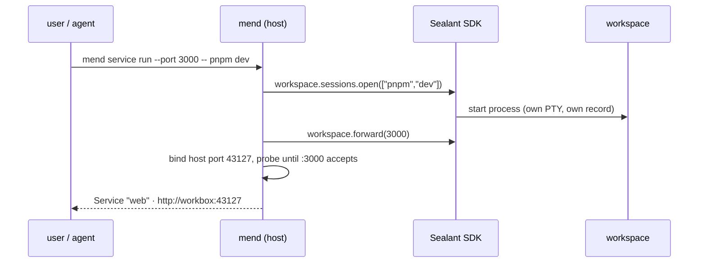
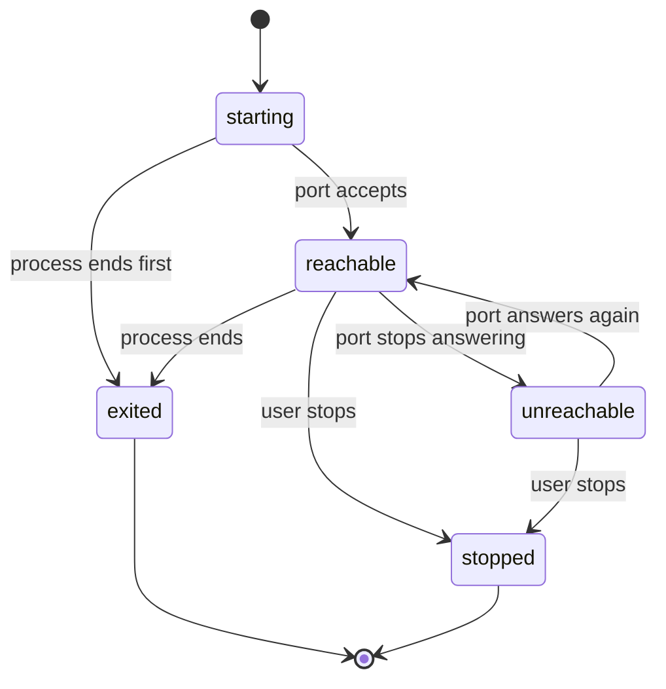

# Session Services

> **Status:** Architecture proposal — supersedes the 2026-08-11 draft
>
> **Date:** 2026-08-12
>
> **Canonical direction:** Read with `MEND-AGENT-WORKBENCH-PLAN.md` §7.6 and §8.1.H. This design
> follows the recorded 2026-08-01 decision: per-port TCP forwards on the machine's private network
> boundary. If adopted, fold the decisions here back into the plan.

## What

A **Service** is a long-running process in a Mend session that the user has explicitly told Mend
about. Once declared, Mend does two things with it:

1. **Makes it reachable.** The user opens it from their laptop or phone as if it ran locally.
2. **Makes it visible.** Services appear on every Mend surface — CLI, web, phone — with observed
   state, logs, and Open / Restart / Stop actions.

Anything that listens on a port qualifies: a Vite dev server, a Postgres container, an Express API,
a Go binary. A Service is part of ongoing work — not a deployment, not a claim that the application
is correct.

## Why

Mend owns the session worktree and runs it inside a Sealant workspace. The user cannot open a
terminal at that worktree and run `pnpm dev`; any server they or their agent starts is trapped
inside the workspace network. That breaks the most ordinary loop in development:

```text
normal checkout                       Mend session
──────────────────────────────       ─────────────────────────────────────────
pnpm dev                             mend service run --port 3000 -- pnpm dev
open http://localhost:3000           open http://workbox:43127
```

Services restore that loop. They also answer a question no single terminal can: _what is running
right now across all my sessions?_ — one list, from any device.

## Two rules

**Explicit only — no detection.** Mend never scans the workspace for listeners or guesses which
process owns a port. Automatic detection across process trees, forks, and containers is fragile and
fails silently; an explicit declaration is one flag and never lies. The agent is taught the same
explicit path (see below), so "run the app so I can look at it" still just works. Static suggestion
is not detection: reading the project's own manifests to _propose_ declarations (see
`mend service init`) is an offline, deterministic read whose output the user confirms — nothing is
observed at runtime and nothing runs.

**No authentication.** A Service is exposed only where the machine already serves private traffic:
loopback and explicitly selected private interfaces (plan §7.5), with Tailscale or similar for
remote private reachability. Never public by default. Securing the private network is the user's
responsibility; Mend adds no login, ticket, or pairing step in front of a dev server.

## The model

A live session has one current workspace. Everything in the session — agent, shell, Services —
shares it: same `/workspace/repo`, same dependencies, same network. When the agent edits a file, the
dev server's watcher sees the write and HMR flows through the Service URL.

```text
Mend session — durable
├── worktree and change — durable
├── conversation and record — durable
└── current workspace — replaceable
    ├── agent process            (harness)
    └── Service · web            (pnpm dev, supervised by Mend)
        Service · db             (existing listener, adopted by port)
```

The agent does not own the workspace; it is one process in it.

There are two ways to declare a Service:

| path                                       | what Mend does                                                        | typical case                             |
| ------------------------------------------ | --------------------------------------------------------------------- | ---------------------------------------- |
| `mend service run --port 3000 -- pnpm dev` | starts and supervises the command in the workspace, forwards the port | dev server, API server the user launches |
| `mend service add 5432 --name db`          | forwards an already-listening workspace port; no supervision, no logs | docker compose database, sidecar process |

That is the whole declaration surface. No promotion prompts, no observation heuristics.

### Declared Services — `mend.toml`

A repository can declare its Services once, in a `mend.toml` at the repo root — versioned with the
code, so it travels to every collaborator and every session worktree:

```toml
[service.web]
command = "pnpm dev"
port = 3000

[service.db]
# No command: an already-listening port to adopt (compose sidecar, external daemon).
port = 5432
```

A declaration is a recipe, never a running process. `mend service run web` starts one by name; the
web and phone **Run Service** forms offer the declared set one-tap; a port-only entry is an `add`
recipe. Nothing autostarts — declaring is not starting. The session's own worktree copy is the one
read, so an agent can add a recipe as part of its change and it reviews like any other edit.

`mend service init` scaffolds the file: it reads the project's own manifests — package.json scripts,
compose files — and proposes entries for the user to confirm and commit. A generator for the recipe
file, nothing more.

## How it works

### Forwarding: one host port per Service, raw TCP

Mend allocates a host port per Service, binds it to loopback and the selected private interfaces,
and pumps bytes to the workspace port over the Sealant SDK forwarding primitive (§8.1.H). No HTTP
proxy, no path rewriting, no header inspection.

```text
laptop / phone                     Mend (host)                        session workspace
──────────────                     ───────────                        ─────────────────
browser ────────▶ workbox:43127 ── byte pump ── workspace.forward(3000) ──▶ :3000 vite
psql ───────────▶ workbox:43128 ── byte pump ── workspace.forward(5432) ──▶ :5432 postgres
```

Raw TCP is a consequence of the requirements, not a preference:

- **Protocol-agnostic.** Postgres, gRPC, and websockets are not HTTP; a byte pump carries them all.
- **Nothing to break.** HMR, SSE, redirects, uploads, and absolute asset paths work because nothing
  inspects the stream.
- **Distinct origin for free.** One port per Service gives each web app its own browser origin, so
  repository code never runs on Mend's authenticated origin.

Two sessions can both use internal port 3000; their workspace networks are isolated and each Service
gets its own host port. The user never resolves collisions.

A friendly lookup (`session:port` → host port) can layer on later in the web UI or via local DNS; it
is presentation, not transport.

### Starting a supervised Service



`mend service run` returns as soon as the port accepts connections (or fails with the process's
output). The Service then lives independently: its own logs, its own lifecycle. It never occupies an
agent tool call.

**The agent uses the same path.** The workspace contains a scoped `mend` helper, and the harness
prompt includes one instruction:

> Use `mend service run --port <port> -- <command>` for any long-running server. Do not background
> it inside a tool call.

The helper's credential permits only session-local actions (start a sibling process, declare a
port); it is not an administrator token.

### Which session?

`mend service` runs from an ordinary host terminal. Inside a workspace the injected helper is
already scoped to its own session; on the host, the CLI resolves the target in this order and never
guesses silently:

1. An explicit argument: `mend service run <session> --port 3000 -- pnpm dev`.
2. The only live session for the adopted project matching the current directory.
3. A compact interactive picker when more than one candidate remains.
4. Otherwise fail and explain — non-interactive callers never get the newest session by default.

Both interactive layers make the explicit argument cheap:

- **Dynamic shell completion.** Shipped zsh/bash/fish completions resolve `<session>` and
  `<service>` arguments live by asking the local Mend daemon (a hidden `mend __complete` command),
  so `mend service run <TAB>` offers live sessions and `mend service logs <TAB>` offers running
  Services.
- **The picker.** A small list TUI (the CLI's existing opentui stack): session name, project, agent
  state, age; type-to-filter, enter to select. The same picker backs every command that needs a
  session or Service and received none.

### Observed states



State words describe what was observed, never a verdict:

```text
reachable     the forwarded port accepts connections
unreachable   process exists (if supervised); port did not answer
exited        supervised process ended; exit code shown
stopped       user requested stop
```

Adopted Services (`service add`) have no process to supervise: they are reachable, unreachable, or
removed.

## Lifecycle

**Workspace leases.** Today the harness settling stops the workspace. With Services, the workspace
stays up while any lease is live:

```text
keep the workspace while any of:
- agent process
- Service
- explicit temporary operation
```

Agent state is harvested when the agent settles; the container is reclaimed when the last lease is
released or a configured expiry passes. Leases are persisted and reconciled after a Mend restart —
Mend re-attaches to the surviving process rather than inventing a new one.

**Disconnection is not intent.** A closed browser, dropped network, or detached CLI never stops a
Service. Stops are explicit: Ctrl-C equivalent via `service stop`, the process exiting on its own,
session close, or expiry.

**Resume.** A settled session resumed later gets a fresh workspace around the same worktree.
Processes do not migrate. The Service's recorded command is offered for explicit restart; nothing
auto-starts.

## Data

Mend currently records one platform PTY per session (`sealantSessionId`). Services require plural
process records:

```text
id
mendSessionId
workspaceId
sealantSessionId          (supervised only)
kind: agent | service
name                      ("web", "db")
command                   (supervised only)
workspacePort
hostPort
status + lastObservedAt
createdAt / exitedAt
```

Persisted per project: previously used Service commands, so web/phone can offer "Run Service" with
one tap.

## Surfaces

```text
mend service run [session] --port <port> [--name <n>] -- <command>
mend service run [session] <name>        start a declared Service (mend.toml recipe)
mend service add [session] <port> [--name <n>]
mend service init                        scaffold mend.toml from the project's manifests
mend service list [session]
mend service logs <service>       (supervised: attach to its PTY/record)
mend service restart <service>
mend service stop <service>
```

Every surface presents the same object:

```text
web                                        reachable
pnpm dev                                   :3000 → workbox:43127

http://workbox:43127

[ Open ] [ Logs ] [ Restart ] [ Stop ]
```

The phone prioritizes Open, state, recent logs, Restart, Stop. It is a control surface for the same
runtime, not a separate execution environment.

`mend shell` — an interactive shell in the session's current workspace, the terminal that is not ssh
— shares all of this plumbing (concurrent processes, plural records, leases, session resolution) and
slots into the delivery order below. Its own design details (shell selection, multiplexer
integrations) stay a separate document; nothing in Services depends on them.

## Platform requirements (Sealant)

Mend consumes the platform only through the public SDK. Needed, tracked in `PLATFORM-FEEDBACK.md`:

- **Workspace port forwarding** — a duplex byte stream to a workspace port, e.g.
  `workspace.forward(port)` (§8.1.H).
- **Concurrent processes per workspace** — verified support for multiple
  `workspace.sessions.open(argv)` processes with independent lifecycle, detach/reattach, signals,
  and exit reporting.

Nothing here requires listener observation, process-tree attribution, or Docker/runtime internals.

**Spike results (2026-08-12, SDK 0.9.0 and 0.13.1 against the deployed platform):** the shared
workspace holds. Two concurrent PTYs in one mount-sourced workspace, independent output streams,
shared filesystem, shared network (a listener opened in one PTY answers a client in the other),
independent close with the sibling unaffected, `sessions.get()` reattach, and resize all verified.
Two platform defects recorded in `PLATFORM-FEEDBACK.md`: `session.signal()` rejects with a daemon
error (raw `^C` through PTY input works as the interim path), and 0.13.1 drops the exit code on a
clean exit.

## Delivery slices

Every platform capability flows sealantd → public SDK → Mend server → CLI → web/phone; each slice
runs that full stack and ships something usable on its own.

1. **Spike: prove concurrency.** No product code. Two PTYs in one workspace via the SDK, independent
   detach/reattach, working directory, resize, signals, exit reporting. The go/no-go for everything
   below.
2. **Lifecycle foundation.** Plural process records and terminal-addressed attachment in Mend;
   workspace leases replacing settle-means-stop; lease and record reconciliation after a Mend
   restart.
3. **`mend shell`.** Session resolution, the picker, dynamic completions. Needs no new platform
   surface beyond the spike — ships standalone value while slice 4's platform work proceeds.
4. **Forward.** Sealantd forwarding capability and the SDK `workspace.forward(port)` primitive (can
   start in the Sealant repo in parallel with 2–3); host port allocation and binding policy;
   `mend service add`; reachable/unreachable states; Service list in CLI and a basic web list.
5. **Supervise.** `mend service run` with port probe and URL report; logs, restart, stop; declared
   Services (`mend.toml` recipes resolved by `service run <name>`); the in-workspace `mend` helper
   and harness instruction.
6. **Everywhere.** Phone Service cards and actions; Run Service form on web (declared recipes
   one-tap); `mend service init` manifest scan; persisted project commands; restart offer on fresh
   workspaces.

## Acceptance scenarios

1. The user runs `mend service run --port 3000 -- pnpm dev` and opens the app on their laptop
   without editing any configuration.
2. The agent, asked to run the app, uses the same command; the user opens the reported URL.
3. The agent edits a component; the browser receives HMR through the Service URL.
4. `mend service add 5432` makes a workspace Postgres reachable from host `psql`.
5. Two sessions both use internal port 3000 and get independent URLs.
6. The agent settles while a Service runs; the workspace survives and states are reported separately
   (`Agent · completed`, `web · reachable`).
7. A closed browser or detached CLI stops nothing; Mend restarts and reconciles the live Service.
8. The same Service opens from a phone on the tailnet with no login step.

## Open decisions

- Default expiry for a workspace whose agent settled but whose Service still runs.
- Host port allocation range and stability (same Service, same port across restarts?).
- The friendly-address lookup (`session:port`), if ever — presentation only.
- Whether a declared Service may opt into starting with the session (`autostart = true` in
  `mend.toml`). The safe default stands: declaring is not starting.
- The full `mend.toml` recipe shape beyond `command` + `port` (cwd, env) — grow it when a real
  project needs the field.
